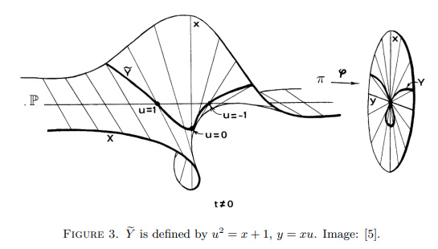

# Hironaka

A utility package for a reinforcement learning study of singularities in algebraic geometry. Resolution of singularities
is a central problem in mathematics: it helps us reduce spaces into smooth manifolds which allow nice theories to
happen.

***What we are doing, TL;DR***:

- A winning strategy of a Hironaka game is [a resolution of certain singular point](what-is-a-resolution-of-singularity)
  in a high dimensional space. Use reinforcement learning to win the game => resolving singularities and solving a range
  of algebraic geometry problems.
- Check out some [resolution trees for ADE singularities](https://github.com/honglu2875/hironaka-experiments/blob/main/5x3-surface-singularities/README.md#model-with-014-score-against-choose-firstchoose-last) by **our neural networks** (*prototypes without fine-tuning!*). Note that there is redundancy on the trees as the game did not terminate on equations like $x + y^2 + z^2 = 0$ where the origin is already smooth.

***Brief Background***:

In 1964 Hironaka proved that it was possible to resolve singularities of varieties over fields of characteristic 0 by
repeatedly blowing up along non-singular subvarieties, using a very complicated argument by induction on the dimension.
Simplified versions of his formidable proof were given by several people, including Bierstone, Milman & 1991-97,
Villamayor (1992), Encinas & Villamayor (1998), Encinas & Hauser (2002), Wlodarczyk (2005), Kollár (2007) and Abramovich
& Tempkin & Wlodarchyk (2019).

Any resolution provides a blow-up graph, which is a rooted tree labelled by clusters of variables. This tree is not
unique; its size and complexity highly depend on some choices. Our knowledge about this complexity is very limited.

***The Goal***:

The ultimate goal of our Hironaka project is to
study the complexity of resolution trees, and find optimal resolutions using Reinforcement Learning. We
calculate invariants of singularities from their resolution trees and attack the classification problem by comparing
singularities and understanding their hierarchies based on their resolution trees.
We hope to apply this to classical conjectures of enumerative geometry: Thom polynomials, Hilbert scheme of points (see
details below).
This project grew out of an attempt to understand the resolution trees in [2]. Any such tree gives a formula for Thom
polynomials and answers a classical question by Thom from 1960.

# Quick start

## Basic usage

[This quick tutorial](https://cocalc.com/share/public_paths/5db3252a0bcb8d068aad2ee53bf5a1ce85753ebf) provides a short
demonstration of some key classes in this repo.

## Reinforcement Learning

There are 3 ways to start training:
- **Best method so far**: Use the JAX implementation of AlphaZero-style MCTS + neural net approach. It runs with more lines but with fine-grained controls(the sample code trains hosts, but can be modified to agent without extra changes):
  ```python
  import jax
  from hironaka.jax import JAXTrainer
  from hironaka.jax.util import select_sample_after_sim
  key = jax.random.PRNGKey(42)
  trainer = JAXTrainer(key, 'jax_config.yml')
  
  role = 'host'
  keys = jax.random.split(key, num=len(jax.devices()) + 2)
  key, subkey = keys[0], keys[1]
  device_keys = keys[2:]
  
  rollout = trainer.simulate(subkey, role, use_mcts_policy=True)
  # Filter out a certain amount of finished games(terminal state), in order to prevent samples from being concentrated with terminal states. But this is merely a sampling trick and can be ignored if you wish.
  mask = jax.pmap(select_sample_after_sim, static_broadcasted_argnums=(0, 2, 3))(role, rollout, 3, True, device_keys)
  
  key, subkey = jax.random.split(key)
  # Train the host for 50 gradient steps.
  trainer.train(subkey, role, 50, rollout, random_sampling=True, mask=mask)
  ```
  It runs on Google cloud TPUs and is already training *thanks to GCP TRC program and Research Credits*!
- **DQN with games/replay buffer and everything on multiple GPUs**: (TL;DR, clone
  this [Google Colab file](https://colab.research.google.com/drive/1nVnVA6cyg0GT5qTadJTJH7aU6smgopLm?usp=sharing) and start your adventure)

  `DQNTrainer` is a quick implementation combining my interface `Trainer` with `stable-baseline3`'s DQN codes. It runs
  in 3 lines:
  ```python
  from hironaka.trainer.dqn_trainer import DQNTrainer
  trainer = DQNTrainer('dqn_config_test.yml')
  trainer.train(100)
  ```
  Of course, for this to work you need to
    - set up the system path so that Python can import those stuff;
    - copy the config file `dqn_config_test.yml` from `.test/` to your running folder.
- **DQN, PPO, A3C, or anything with stable-baselines3**: When you are here in the project folder and `requirements.txt` are met (or create a venv and
  run `pip install -r requirements.txt`), try the following:
  ```bash
  python train/train_sb3.py
  ```
  It starts from our base classes `Host, Agent`, goes through the gym
  wrappers `.gym_env.HironakaHostEnv, .gym_env.HironakaAgentEnv`, and ends up using `stable_baseline3`'s
  implementations. In this particular script, it uses their `DQN` class. But you can totally try other stuff like `PPO`
  with corresponding adjustments.

## Experiments

Some of our experimental results are documented here: https://github.com/honglu2875/hironaka-experiments

# Contents

For ML and RL specialists, hopefully the [Quick Start](#quick-start) already gives you a good idea about where to start.
In addition, please check out

- [Rule of the game](#rule-of-the-game)
- [The structure of the repo](#the-structure-of-the-repo)

For math-oriented viewers or ML experts who are intrigued about the background story, please feel free to continue with:

- [What is a resolution of singularity](#what-is-a-resolution-of-singularity)
- [What is Hironaka's polyhedral game](#what-is-hironakas-polyhedral-game)
- [Variations of Hironaka's game](#variations-of-hironakas-game)
- [Mathematical application and conjectures](#mathematical-applications-and-open-questions)

# Rule of the game

## The definition of the (basic) game

All versions of the game consist of 2 players. They operate in a non-symmetric fashion. To emphasize the
difference, let us call Player A the "host", player B the "agent". For every turn, the game has a `state`, the host
makes
a move, and the agents makes a move. Both moves together change the `state` of the game. Among all the variations of
Hironaka games, there is a simplest version underlying all the rest which we introduce below.

### States

A `state` is represented by a set of points $S\in\mathbb Z^n$ satisfying certain rules depending of the different
versions
of the game. At each turn,

- The host chooses a subset $I\subset \{1,2,\cdots, n\}$ such that $|I|\geq 2$.
- The agent chooses a number $i\in I$.

### State change

$I, i$ together changes the `state` $S$ to the next according to the following linear change of variables:

$$x_j \mapsto \begin{cases}x_j, &\qquad\text{if } i\neq j \newline \sum\limits_{k\in I} x_k, &\qquad\text{if }i=j
\end{cases},$$

for points $(x_1,\cdots,x_n)\in \mathbb Z^n$. We subsequently apply Newton polytope to the transformed points and only
keep the vertices.

A `state` is terminal if it consists of one single point. In this case, the game will not continue and the host is
declared to be the winner. As
a result, the host wants to reduce the number of $S$ as quickly as possible. On the other hand, the agent wins if it can
stall the game forever (possible!). For a tangible implementation, we can either give the agent rewards for stalling as
long as possible, or give the agent penalty for letting the host end the game (the latter is used in our implementation)
.

## Rewards and metrics

Defining the reward function is an open-ended question. But our goal is:

- The host needs to minimize the game length (to stop in finite steps is already a challenge).
- The agent needs to maximize the game length.

Therefore, the most straightforward reward function for a host is `1 if game.ended else 0`. For agent, we switch around
to `1 if not game.ended else 0`. There are more versions of reward functions (e.g., step rewards being the number of
points in the state eliminated). But experiments
have been telling us to focus on the original one.

### An interesting metric: $\rho$

With certain amount of abuse of notations (please forgive me for omitting the dependence on random initial states and
sequences of actions), the metric is heuristically described as follows:

Fix a pair of host and agent. Given an integer $n$, we can run a random game for $n$ steps (restart another random game
if ended). Let $g(n)$ be the number of games that happen during the $n$ steps. An important metric that measures the
pair of host and agent is the ratio

$$\rho(n) = \dfrac{g(n)}{n}.$$

This ratio directly relates to the cumulative rewards for host and agent ($n\rho(n)$ for host and $n(1-\rho(n))$ for
agent). If a limit

$$\DeclareMathOperator*{\lim}{\text{lim}}\rho = \displaystyle\lim_\limits{n\rightarrow\infty}\rho(n)$$

exists (w.r.t. random initializations over a compact subspace of states), it would be an important measure for the pair
of host and agent:

- if $\rho$ is high, the host is strong;
- if $\rho$ is low, the agent is strong.

The existence of the limit is not proven, but empirically $\rho(n)$ seems to converge to some values when $n$ grows
larger.

# The structure of the repo

Here are a few important places to go:

- [hironaka.jax](hironaka/jax) A standalone module fully devoted to JAX implementations. The structure is quite different and the implementation is heavily relying on functions, so I separate `JAXTrainer` out of `hironaka.trainer`. Despite being critical about JAX semantic designs in the very beginning, I have been converted into a big fan of JAX, as it is incredibly fast and functional programming really makes sense here!
- [hironaka.trainer](hironaka/trainer) is my implementation of DQN where I put games/replay buffers all on GPU, and can be wrapped up by DP/DDP.
- [hironaka.train](train) Some training scripts. `train_sb3.py`, `jax_mcts.py` are battle-tested and already produced models for us.
- [hironaka.core](hironaka.core) Abstractions of game states and transformations. `JAXPoints`, `ListPoints`, `TensorPoints` correspond to different implementations using JAX, native List, and PyTorch, respectively.
- [.host](host.py), [.agent](agent.py), [.game](game.py), are simple abstractions of host, agent and the game. Good for simple manipulations of gameplay but most trainings are not based on them.

---
Now the big question is, how this game is related to some fundamental questions in pure math, or specifically, algebraic
geometry.

# What is a resolution of singularity

An affine algebraic variety

$$X =\{(x_1,\ldots, x_n): f_1(x_1,\ldots, x_n)=\ldots =f_k(x_1,\ldots, x_n)=0\} \subset A^n$$

is the common zero locus of polynomial equations. Affine varieties play central role in mathematics, physics and
biology.

Affine varieties cut out by one polynomial equation are called affine hypersurfaces. E.g

$$X=\{(x_1,\ldots, x_n):f(x_1,\ldots, x_n)=0\}$$

## Singularities

We can think of varieties as "shapes in affine spaces", and at a generic point
$x \in X$ the variety locally is $A^r$ for some $r$, which we call the dimension of $X$.
However, there are special, ill-behaved points, where the local geometry of $X$ is less patent.

The set $X$ is singular at a point $a \in X$ if the Jacobian matrix

$$Jac(X,a)=\left(\frac{\partial f_i}{\partial x_j}\right)(a)$$

at a is of rank smaller than $n-dim(X)$. The set of singular points of $X$ is called the singular locus of $X$.

## Blow-up: turning singularities into smooth points

Resolution of singularities is a classical central problem in geometry. By resolution we mean that we substitute the
original,
possibly singular $X$ with a nonsingular $Y$ with a proper
birational map $f:Y \to X$ such that $f$ is an isomorphism over some open dense subset of X.

The celebrated Hironaka theorem asserts that such resolution exists for all $X$, and it can be constructed from an
elementary type of operation called blowing up. Blowing up or blowup is a type of geometric transformation which
replaces a subspace of a given space with all the directions pointing out of that subspace.

For example, the blowup of a point in a plane replaces the point
with the projectivized tangent space at that point. The geometric picture looks like the following:



([The lecture note where I took the screenshot from](https://www.maths.tcd.ie/~btyrrel/flatness.pdf).
This picture ultimately came from our beloved textbook: Algebraic geometry *by Robin Hartshorne*)

## Hironaka's theorem

The most famous and general result concerning resolution of singularities was given by Heisuke Hironaka in 1964
He proved that the resolution of singularities can be achieved by a sequence of blowups

$$Y=X_n \to X_{n-1} \to \ldots \to X_0=X$$

if the characteristic of the base field is zero.

This beautiful and fundamental work was recognized with a Fields medal in 1970. Recently, Villamayor and, independently,
Bierstone and Milman have clarified the process of resolution of singularities in characteristic zero,
explicitly describing the algorithmic nature of the resolution process.

Using de Jong's deep ideas, simple proofs of Hironaka's theorem have been discovered by de Jong and Abramovich and by
Bogomolov and Pantev.

The latest big progress in approaching a simple resolution algorithm was achieved by
Abramovich-Tempkin-Vlodarczyk and independenty by McQuillen, who
came up with a simple stacky presentation using weighted blow-ups.

# What is Hironaka's polyhedral game

In the literature, there appear at least 11 proofs for Hironaka's celebrated theorem on the resolution of singularities
of varieties of arbitrary dimension defined over fields of characteristic zero. These proofs associate invariants to
singularities, and show that certain type of blow-ups improve the invariant.

We can interpret resolution as a game between two players. Player A attempts to improve the singularities.
Player B is some malevolent adversary who tries to keep the singularities alive as long as possible.
The first player chooses the centres of the blowups, the second provides new order functions after each blowup.

# Variations of Hironaka's game

## Short summary

The formulation of the resolution as a game goes back to Hironaka himself. He introduced the polyhedra game where
Player A has a winning strategy, which provide resolution of hypersurface singularities. He formulated a "hard"
polyhedra game, where a winning strategy for Player A would imply the resolution theorem in full generality, but such
winning strategy does not necessarily exist.
Later Hauser defined a game which provided a new proof of the Hironaka theorem.

Certain modified version of the game, due to Bloch and Levine provide solutions to the moving cylcles problem.
Finally, recent work of Berczi shows that a restricted weighted version of the Hironaka game provides closed integration
formulas over Hilbert scheme of points on manifolds.

## The basic version of the game

This project started out with [this basic version of the game](#the-definition-of-the-basic-game) (see the link for the
rules).
It is a simplified version of [Hironaka's original polyhedra game](#hironakas-polyhedra-game).

## Hauser game

This version of the Hironaka game was suggested by Hauser. A simple winning strategy was given by Zeillinger. The
existence of winning
strategy proves the resolution theorem for hypersurfaces.

**The rules:**

- `states`: A finite set of points $S\subset\mathbf{N}^n$, such that $S$ is the set of vertices of the positive
  convex hull $\Delta=\{S+\mathbf{R}^n_+\}$.
- `state change`: Given the pair $(I,i)$ chosen by the host, for $x=(x_1,\cdots,x_n)\in\mathbb Z^n$ we define
  $T_{I,i}(x)=(x_1',\ldots, x_n')$ where

$$x_j' = \begin{cases}x_j, &\qquad\text{if } i\neq j \newline \sum\limits_{k\in I} x_k, &\qquad\text{if }i=j
\end{cases},$$

The new `state` $S'$ is formed by the vertices of the Newton polyhedron of $\Delta'=${$T_{I,i}(x):x\in S$}.

- `terminal states`: a state $S$ is terminal if it consists of one single point.

In short, the host wants to reduce the size of $S$ as quickly as possible, but the agent wants to keep the size of
$S$ large.

## Hironaka's polyhedra game

This is the original Hironaka game from 1970. A winning strategy for the host
was given by Mark Spivakovsky in 1980, which proved the resolution theorem for hypersurfaces.

**The rules:**

- `states`: A finite set of rational points $S \subset \mathbf{Q}^n$, such that $\sum\limits_{i=1}^n x_i>1$ for all
  $(x_1,\ldots, x_n)\in S$, and $S$ is the set of vertices of the positive
  convex hull $\Delta=\{S+\mathbf{R}^n_+\}$.
- `move`: The host chooses a subset $I\subset${$1,2,\cdots, n$} such that $|I|\geq 2$ and
  $\sum\limits_{i\in I}x_i\ge 1$ for all $(x_1,\ldots, x_n)\in S$. The agent chooses a number $i\in I$.
- `state change`: Given the pair $(I,i)$ chosen by the host, for $x=(x_1,\cdots,x_n)\in \mathbb Z^n$ we define
  $T_{I,i}(x)=(x_1',\ldots, x_n')$ where

$$x_j' = \begin{cases}x_j, &\qquad\text{if } i\neq j \newline \sum\limits_{k\in I} x_k -1, &\qquad\text{if }i=j
\end{cases},$$

The new `state` $S'$ is formed by the vertices of the Newton polyhedron of $\Delta'=${$T_{I,j}(x):x\in S$}.

- `terminal states`: a state $S$ is terminal if it consists a point $(x_1,\ldots, x_n)$ such that
  $\sum\limits_{i=1}^n x_i \le 1$.

## Hard polyhedra game

The hard polyhedra game was proposed by Hironaka in 1978.
Hironaka has proved that an affirmative solution of this game would imply the local uniformization theorem for an
algebraic variety over an algebraically closed field of any characteristic.
Mark Spivakovsky showed that Player A does not always have a winning strategy

**The rules:**

- `states`: A finite set of rational points $S \subset \mathbf{Q}^n$, such that $\sum\limits_{i=1}^n x_i>1$ for all
  $(x_1,\ldots, x_n)\in S$, the denominators are bounded by some fix $N$, and $S$ is the set of vertices of the positive
  convex hull $\Delta=\{S+\mathbf{R}^n_+\}$.
- `move`: The host chooses a subset $I\subset${$1,2,\cdots, n$} such that $|I|\geq 2$ and
  $\sum\limits_{i\in I}x_i\ge 1$ for all $(x_1,\ldots, x_n)\in S$.
  The agent chooses some element $i\in S$ and modifies the Newton polygon $\Delta$ to a set $\Delta^*$ by
  the following procedure: first, the agent selects a finite number of points $y=(y_1,\ldots, y_n)$, all of whose
  coordinates are rational numbers with denominators bounded by $N$ as above, and for each of which there exists
  an $x = (x_1, \ldots, x_n)\in \Delta$ which satisfy some basic relations. $\Delta^\star$ is then taken to be the
  positive
  convex hull of $\Delta \cup \{\text{selected points}\}$.

- `state change`: Given the pair $(I,i)$ chosen by the host, for $x=(x_1,\cdots,x_n)\in \mathbb Z^n$ we define
  $T_{I,i}(x)=(x_1',\ldots, x_n')$ where

$$x_j' = \begin{cases}x_j, &\qquad\text{if } i\neq j \newline \sum\limits_{k\in I} x_k -1, &\qquad\text{if }i=j
\end{cases},$$

The new `state` $S'$ is formed by the vertices of the Newton polyhedron of $\Delta'=${$T_{I,j}(x):x\in S$}.

- `terminal states`: a state $S$ is terminal if it consists a point $(x_1,\ldots, x_n)$ such that
  $\sum\limits_{i=1}^n x_i \le 1$.

## The Stratify game

In 2012 Hauser and Schicho introduced a combinatorial game, called Stratify. It exhibits the axiomatic and logical
structure of the existing proofs for the resolution of singularities of algebraic varieties in characteristic zero.
The resolution is typically built on a sequence of blowups in smooth centres which are chosen as the smallest stratum
of a suitable stratification of the variety. The choice of the stratification and the proof of termination of the
resolution procedure are both established by induction on the ambient dimension.

## Thom game

In 2021 Berczi introduced the Thom game, which is a weighted version of the Hironaka game. It has a winning strategy,
and
every run of the game provides a blow-up tree, which encodes a formula for Thom polynomials of singularities, answering
long-standing question in enumerative geometry.

**The rules:**

- `states`: A pair (S,w), where: S is a finite set of points $S \subset \mathbf{N}^n$, such that $S$ is the set of
  vertices of the positive convex hull $\Delta=\{S+\mathbf{R}^n_+\}$; $w=(w_1,\ldots, w_n)\in \mathbf{N}^n$ is a weight
  vector associating a nonnegative integer weight to all coordinates.
- `move`: The host chooses a subset $I\subset ${$1,2,\cdots, n$} such that $|I|\geq 2$ and
  $\sum\limits_{i\in I}x_i\ge 1$ for all $(x_1,\ldots, x_n)\in S$.
  The agent chooses an $i\in I$ such that $w_i$ is minimal in $\{w_j: j\in I\}$.
- `state change`: Given the pair (I,i) chosen by the host, for $x=(x_1,\cdots,x_n)\in \mathbb Z^n$ we define
  $T_{I,i}(x)=(x_1',\ldots, x_n')$ where

$$x_j' = \begin{cases}x_j, &\qquad\text{if } i\neq j \newline \sum\limits_{k\in I} x_k, &\qquad\text{if }i=j
\end{cases},$$

The new `state` $S'$ is formed by the vertices of the Newton polyhedron of $\Delta'=\{T_{I,i}(x):x\in S\}$, shifted by
a positive integer multiple of $(-1,\ldots, -1)$ such that $S'$ still sits in the positive quadrant, but any
further shift will move it out.
The new weight vector is

$$w'_j=\begin{cases}w_j, &\qquad\text{if } j=i \quad\text{or}\quad j\notin I \newline w_j-w_i &\qquad\text{if } j \in
I\setminus \{i\}
\end{cases},$$

- `terminal states`: a state $S$ is terminal if it consists of one single point, and

## The Abramovich-Tempkin-Vlodarczyk game

In 2020 Abramovich-Tempkin-Vlodarczyk introduced a new resolution algorithm, based on weighted blow-ups. It
significantly
simplifies the resolution process and uses intrinstic invariants of singularities which improve
after each blow-up. One goal of the our Hironaka project is to reformulate this algorithm as a game, and use RL to
study its performance.

# Mathematical applications and open questions

The goal in each version of the game is to find better (i.e smaller) blow-up trees. This question has more precise
formulation in specific problems. Here is a list of mathematical applications we are interested in.

## Hilbert scheme of points on manifolds

Let $X$ be a smooth projective variety and $n$ a positive integer. Assume that we have $n$ distinct points
which can freely move around on $X$. If we want to compactify this phase space, we must let the points collide in
a geometrically meaningful way. The Hilbert scheme of $n$ points on $X$, denoted by $\mathrm{Hilb}^n(X)$, is
a compactification of this parameter space which plays a central role in enumerative geometry.
Many classical problems can be transformed into integration of tautological forms on (geometric subsets) of
$\mathrm{Hilb}^n(X)$:

- Counting hypersurfaces (curves) with given singularities in linear systems

- Counting maps between manifolds with given set of singularities

- Determining cohomological locus of a given singularity for maps between manifolds (Thom polynomials)

- Cohomological locus of multi-singularity locus of maps

- The Segre-Verlinde duality conjecture in higher dimensions

In [4] we develop a new integral formula for tautological integrals over Hilbert scheme of points. The
formula involves a blow-up tree generated by the Thom game: it is the sum of certain rational expressions over a certain
set of leaves of the tree. Hence the complexity of the formula is determined by the complexity of the Thom tree.

## Singularity theory and Thom polynomials

Global singularity theory is a classical subject which classifies singularities of maps between manifolds, and
describes topological reasons for their appearance. Let $f:M \to N$ be a generic map between complex manifolds $M$ and
$N$.
and let $T$ be a singularity type, determined by its local algebra $A(T)$. The Thom polynomial of $A$ is the cohomology
class
$[\Sigma_A]$ dual to the locus in $M$ where the local algebra of $f$ is isomorphic to $A(T)$.

In [5] we develop a formula for Thom polynomials, which is in [2] reduced to toric geometry and a sum over
leaves of the blow-up tree obtained by the Thom game on a special ideal.

## The Chern Positivity Conjecture for singularities

In 2001 Rimanyi conjectured that the Thom polynomials expressed in the Chern classes of $f$ have nonnegative integer
coefficients. This conjecture remained hopeless and intact since its formulation. It is a topological analogue of the
Stanley e-positivity conjecture for chromatic polynomials on graphs.

Training a deep network these coefficients for Thom trees corresponding to monomial ideals might help us in
understanding these
nonnegative coefficients.

## The Monomialisation Conjecture of morphisms

Monomialization conjecture is a massive classical conjecture, which is a relative formulation of the resolution problem.
It asserts that any morphism of varieties over a field of characteristic zero can be transformed via blowups of source
and target into a monomial morphism,
i.e., a morphism which can be expressed in suitable local coordinates by monomials.
There have been important recent advances by Cutkosky and Abramovich, Karu, Matsuki and Wlodarcyzk.
In positive characteristic there are simple counterexamples.

## References

[1] Dan Abramovich, Michael Temkin, and Jaroslaw Wlodarczyk, Functorial embedded resolution via weighted blowing ups,
2019 preprint

[2] G. Berczi, Non-reductive GIT and Thom polynomials, 2020 preprint

[3] G. Berczi, Tautological integrals on curvilinear Hilbert schemes, Geom. Topol, 21 (2017), no. 5, 2897-2944

[4] G. Berczi, Tautological integrals on Hilbert scheme of points on manifolds I,II, in preparation

[5] G. Berczi and A. Szenes, Thom polynomials of Morin singularities, Annals of Mathematics, 175 (2012), 567-629.

[6] G. Berczi and A. Szenes, Multiple-point residue formulas for holomorphic maps, arXiv:2112.15502

[7] E. Bierstone and P. Milman, ‘Canonical desingularization in characteristic zero by blowing up the maximum strata of
a local invariant’, Invent. Math. 128 (1997) 207–302.

[8] H. Hauser and J. Schicho, 'A game for the resolution of singularities', Proceedings of LMS, Volume 105, Issue 6,
Pages 1149-1182

[9] H. Hironaka, ‘Resolution of singularities of an algebraic variety over a field of characteristic 0’, Ann. of Math.
79 (1964) 109–326.
Press, Princeton, NJ, 2007).

[10] H. Hironaka, ‘Characteristic polyhedra of singularities’, J. Math. Kyoto Univ. 7 (1967) 251–293.

[11] M. Spivakovsky, ‘A counterexample to Hironaka’s “hard” polyhedral game’, Publ. Res. Inst. Math. Sci. 18 (1982)
1009–1012.

[12] M. Spivakovsky, ‘A solution to Hironaka’s polyhedral game’, Arithmetic and geometry (eds M. Artin and J. Tate;
Birkḧauser, Basel, 1983) 419–432.

[13] J. Vlodarczyk, ‘Simple Hironaka resolution in characteristic zero’, J. Amer. Math. Soc. 18 (2005) 779– 822.

[14] Michael McQuillan, Very fast, very functorial, and very easy resolution of singularities, 2019, preprint, written
with the collaboration of G. Marzo.

[15] D. Zeillinger, ‘Polyhedral games and resolution of singularities’, PhD Thesis, Univ. Innsbruck, 2006.
