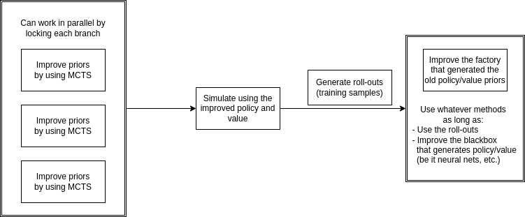

# Summary

This module contains all the components needed for training with [JAX](https://github.com/google/jax)
and [mctx](https://github.com/deepmind/mctx).
We break down component into (factory) functions included in:

- [.net](net.py)
- [.players](players.py)
- [.recurrent_fn](recurrent_fn.py)
- [.simulation_fn](simulation_fn.py)
- [.util](util.py)

and package the whole process in the class [`JAXTrainer`](JAXTrainer.py). But feel free to use the functions for
fine-grained modifications.
JAX is ultimately built under functional programming concepts. It is easier to maintain key parts as individual
functions than sophisticated hierarchies of classes.
Also, because of this, I separate the whole JAX support from [`hironaka.trainer`](../trainer) module which has quite a
different design.

# Architecture

MCTS-based RL algorithms tend to have the following general architecture:

Given functions of priors $\pi, v$ that map observations to policy logits and values, it goes through loops whose bodies
looks like the following:



The library [mctx](https://github.com/deepmind/mctx) already provided components that can be built to handle the first
block. Here, we build the rest.

## .net

This module provides utilities related to neural networks

## .players

This module provides hard-coded players that serve as fixed opponents in the game environments. They can be hardened by
using jit compile (or at least use `partial` to fix some un-jittable tracers).

## .recurrent_fn

This creates the most important components that connect to [mctx](https://github.com/deepmind/mctx). Members
create `recurrent_fn` that can be fed into `mctx` policies.

### What a recurrent function does

In short, it collects an observation and an action, and spits out

- a vector of policy logits,
- a value prior,
- the next observation,
- reward, discount, etc.

As one might notice, the first two are provided by the policy network (in neural net based approaches), and the last two
are standard output for an environment. Thus, a `recurrent_fn` is a combination of a policy network and an environment.

## .simulation_fn

This provides functions to simulate from the root and generate roll-outs.

## .JAXTrainer

This is a package of all the above and initialize based on a config file (like `jax_config.yml`).

A sample usage:
```python
import jax
from hironaka.jax import JAXTrainer

key = jax.random.PRNGKey(42)
trainer = JAXTrainer(key, "jax_config.yml")

for role in ['host', 'agent']:
    key, subkey = jax.random.split(key)
    rollout = trainer.simulate(subkey, role)
    trainer.train(subkey, role, 10, rollout, random_sampling=True)
```

There are many little things and we recommend to check out the doc in the code. 