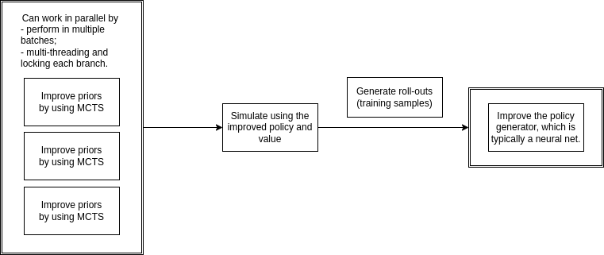

# Summary

This module contains all the components needed for training with [JAX](https://github.com/google/jax)
and [mctx](https://github.com/deepmind/mctx).
We break down components into (factory) functions included in:

- [.net](net.py)
- [.players](players.py)
- [.recurrent_fn](recurrent_fn.py)
- [.simulation_fn](simulation_fn.py)
- [.util](util.py)
- [.loss](loss.py)
- [.host_action_preprocess](host_action_preprocess.py)

Some helper functions or executable scripts to help visualize the full host tree and MCTS tree.
- [.search](search.py)
- [.analysis](analysis.py)

and package the whole process in the class [`JAXTrainer`](jax_trainer.py). But feel free to use the functions for more
fine-grained modifications.
JAX is ultimately built under functional programming concepts. It is easier to maintain key parts as individual
functions than sophisticated hierarchies of classes.
Because of this, I separate the whole JAX facilities from [`hironaka.trainer`](../trainer) module which has been using 
OOP very extensively.

# Architecture

MCTS-based RL algorithms tend to have the following general architecture:

Given functions of policy priors and values $\pi, v$, it goes through loops whose bodies
looks like the following:



The library [mctx](https://github.com/deepmind/mctx) already provided components that can be built to handle the first
block. Here we try to put things together. Note that we only take advantage of the batch operations but have not implemented multi-thread MCTS.

## .JAXTrainer

This is a package of all the functions into a training/validating process. It initializes based on a config file (e.g., `jax_config.yml`).

A sample usage:

```python
import jax
from hironaka.jax import JAXTrainer

key = jax.random.PRNGKey(42)
trainer = JAXTrainer(key, "jax_config.yml")

for role in ['host', 'agent']:
    key, subkey = jax.random.split(key)
    rollout = trainer.simulate(subkey, role)
    trainer.train(subkey, role, 10, rollout, random_sampling=True)
```

## .net

This module provides utilities related to neural networks

## .players

This module provides hard-coded players that serve as fixed opponents in the game environments. They can be hardened by
using jit compile (or at least use `partial` to fix some un-jittable tracers).

## .recurrent_fn

This creates the most important components that connect to [mctx](https://github.com/deepmind/mctx). Members
create `recurrent_fn` that can be fed into `mctx` policies.

### What a recurrent function does

In short, it collects an observation and an action, and spits out

- a vector of policy logits,
- a value prior,
- the next observation,
- reward, discount, etc.

As one might notice, the first two are provided by the policy network (in neural net based approaches), and the last two
are standard output for an environment. Thus, a `recurrent_fn` is a combination of a policy network and an environment.

## .simulation_fn

This provides functions to simulate from the root and generate roll-outs.

## .loss

It contains several helper functions related to the computation of the loss.

## .host_action_preprocess

It has several helper functions regarding the conversion of host discrete actions into multi-binary encoding. For example, when dimension is 3, the host can make choices in coordinate 0, 1, and 2, as long as 2 or more are chose.
The most obvious way to encode this action is by a multi-binary array:
- E.g., the choice of 0 and 1 would become (1., 1., 0.)

But regarding all the choices as discrete actions, one may also try to label them as one-hot encoding over the number of all coordinate subsets.
- E.g., we can say (1., 1., 0.) is the action 0, (1., 0., 1.) is the action 1, (0., 1., 1.) is the action 2 and (1., 1., 1.) is the action 3. In this convention, (1., 1., 0.) corresponds to the one-hot encoding (1., 0., 0., 0.).

Some simple encode-decode helper functions are necessary for this purpose. We use a look-up table to make the query constant time (for a fixed dimension).

## .search
Contains a `TreeNode` class and `search_tree_fix_host` to help investigate the full tree fixing a host.
An executable script is also included, which was used to print out the resolutions for A, D, E singularities.

## .analysis
Contains helper functions to print out the MCTS search tree.

